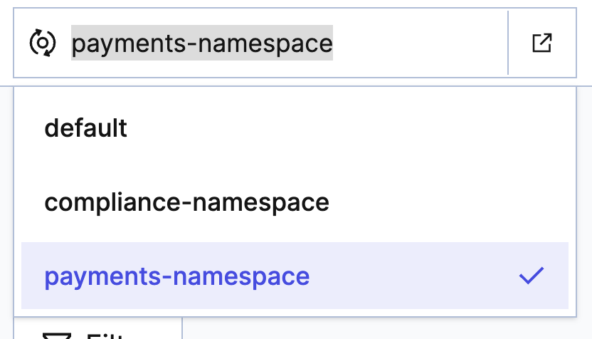
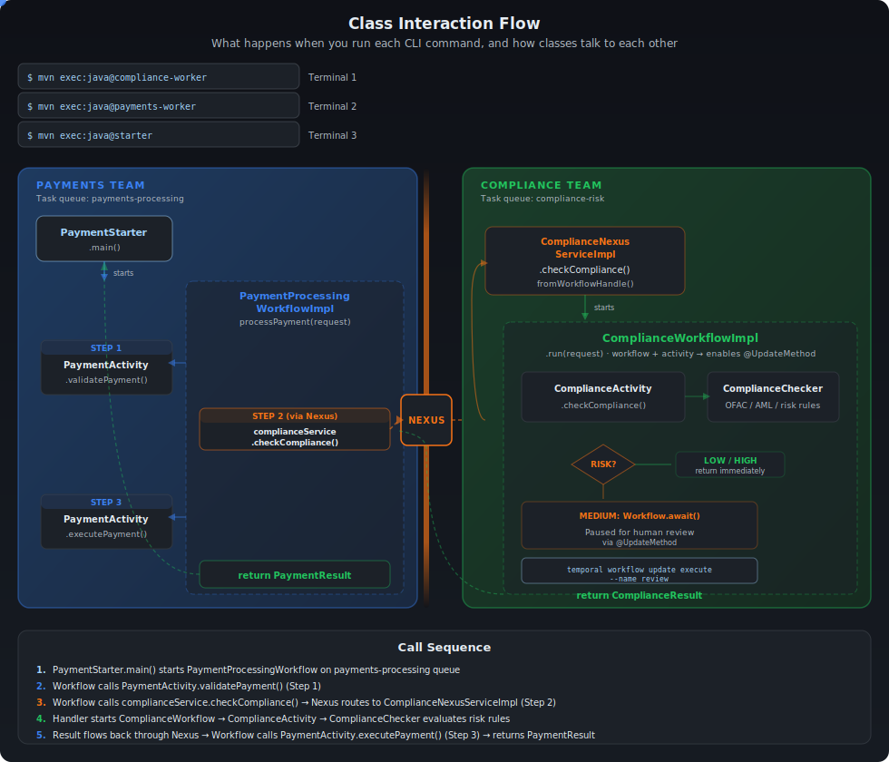

# Decouple Monolith

**Language:** Java | **Prereqs:** Temporal workflows & activities

## Table of Contents

- [Scenario](#scenario)
- [Why Nexus?](#why-nexus)
- [Overview](#overview)
- [Checkpoint 0: Run the Monolith](#checkpoint-0-run-the-monolith)
- [The TODOs](#the-todos)
- [The Compliance Workflow (already in the exercise)](#the-compliance-workflow-already-in-the-exercise)
- [TODO 1: Create the Nexus Service Interface](#todo-1-create-the-nexus-service-interface)
- [TODO 2: Implement the Nexus Handler](#todo-2-implement-the-nexus-handler)
- [TODO 3: Create the Compliance Worker](#todo-3-create-the-compliance-worker)
- [Checkpoint 1: Compliance Worker Starts](#checkpoint-1-compliance-worker-starts)
- [Checkpoint 1.5: Create the Nexus Endpoint](#checkpoint-15-create-the-nexus-endpoint)
- [TODO 4: Replace Activity Stub with Nexus Stub](#todo-4-replace-activity-stub-with-nexus-stub)
- [TODO 5: Update the Payments Worker](#todo-5-update-the-payments-worker)
- [Checkpoint 2: Full Decoupled End-to-End](#checkpoint-2-full-decoupled-end-to-end)
- [Checkpoint 3: Durability Across the Boundary](#checkpoint-3-durability-across-the-boundary)
- [TODO 6: Send a Workflow Update via Nexus (Sync Handler)](#todo-6-send-a-workflow-update-via-nexus-sync-handler)
- [Bonus Exercise: What Happens When You Wait Too Long?](#bonus-exercise-what-happens-when-you-wait-too-long)
- [Quiz](#quiz)

---

## Scenario

You work at a bank where every payment flows through **three steps**:

1. **Validate** the payment (amount, accounts)
2. **Check compliance** (risk assessment, sanctions screening)
3. **Execute** the payment (call the gateway)

Two teams split this work:

<table>
<tr>
<th>Team</th>
<th>Owns</th>
<th>Task Queue</th>
</tr>
<tr>
<td><strong>Payments</strong></td>
<td>Steps 1 &amp; 3 — validate and execute</td>
<td><code>payments-processing</code></td>
</tr>
<tr>
<td><strong>Compliance</strong></td>
<td>Step 2 — risk assessment &amp; regulatory checks</td>
<td><code>compliance-risk</code></td>
</tr>
</table>

### The Problem

Right now, **both teams' code runs on the same Worker**. One process. One deployment. One blast radius.

That's a problem because the Compliance team deals with sensitive regulatory work — OFAC sanctions screening, anti-money laundering (AML) monitoring, risk decisions — that requires stricter access controls, separate audit trails, and its own release cycle. Payments has none of those constraints. But because both teams share a single process, they're forced into the same failure domain, the same security perimeter, and the same deploy pipeline.

In practice, that shared fate plays out like this: Compliance ships a bug at 3 AM. Their code crashes. But it's running on the Payments Worker — so **Payments goes down too**. Same blast radius. Same 3 AM page. Two teams, one shared fate.

The obvious fix is splitting them into microservices with REST calls. But that introduces a new problem: if Compliance is down when Payments calls it, the request is lost. No retries. No durability. You're writing your own retry loops, circuit breakers, and dead letter queues. You've traded one problem for three.

### The Solution: Temporal Nexus

[**Nexus**](https://docs.temporal.io/nexus) gives you team boundaries **with** durability. Each team gets its own Worker, its own deployment pipeline, its own security perimeter, its own blast radius — while Temporal manages the durable, type-safe calls between them.

The Payments workflow calls the Compliance team through a Nexus operation. If the Compliance Worker goes down mid-call, the payment workflow just...waits. When Compliance comes back, it picks up exactly where it left off. No retry logic. No data loss. No 3am page for the Payments team.

The best part? The code change is almost invisible:

```java
// BEFORE (monolith — direct activity call):
ComplianceResult compliance = complianceActivity.checkCompliance(compReq);

// AFTER (Nexus — durable cross-team call):
ComplianceResult compliance = complianceService.checkCompliance(compReq);
```

Same method name. Same input. Same output. Completely different architecture.

<p align="center">
  
</p>

## Why Nexus?

You could split Payments and Compliance into microservices with REST calls. But then you'd write your own retry loops, circuit breakers, and dead letter queues. Here's how the options compare:

| | REST / HTTP | Direct Temporal Activity | Temporal Nexus |
|---|---|---|---|
| **Worker goes down** | Request lost, manual retry | Same crash domain | Workflow pauses, auto-resumes |
| **Retry logic** | Write it yourself | Temporal retries within team | Built-in across the boundary |
| **Type safety** | OpenAPI + code gen | Java interface | Shared Java interface |
| **Human review** | Custom callback URLs | Couple teams together | `@UpdateMethod`, durable wait |
| **Team independence** | Shared failure domain | Shared deployment | Separate workers, blast radii |
| **Code change** | Full rewrite | — | One-line stub swap |

> 🚀 **New to Nexus?** Try the [Nexus Quick Start](https://docs.temporal.io/nexus) for a faster path. Come back here for the full decoupling exercise.

---

## Overview

<p align="center">
  
</p>


> **Interactive version:** Open [`ui/nexus-decouple.html`](ui/nexus-decouple.html) in your browser to toggle between Monolith and Nexus modes with animated data flow.

---

## Checkpoint 0: Run the Monolith

Before changing anything, let's see the system working. You need **3 terminal windows** and a running Temporal server.

**Terminal 0 — Temporal Server** (if not already running):
```bash
temporal server start-dev
```

**Create namespaces** (one-time setup):
```bash
temporal operator namespace create --namespace payments-namespace
temporal operator namespace create --namespace compliance-namespace
```

**Terminal 1 — Start the monolith worker:**
```bash
cd exercise
mvn compile exec:java@payments-worker
```

You should see:
```log
Payments Worker started on: payments-processing
Registered: PaymentProcessingWorkflow, PaymentActivity
            ComplianceActivity (monolith — will decouple)
```

**Terminal 2 — Run the starter:**
```bash
cd exercise
mvn compile exec:java@starter
```

** Change the namespace in Temporal UI **



**Expected results:**

<table>
<tr>
<th>Transaction</th>
<th>Amount</th>
<th>Route</th>
<th>Risk</th>
<th>Result</th>
</tr>
<tr>
<td><code>TXN-A</code></td>
<td>$250</td>
<td>US &#x2192; US</td>
<td>&#x1F7E2; LOW</td>
<td>&#x2705; <code>COMPLETED</code></td>
</tr>
<tr>
<td><code>TXN-B</code></td>
<td>$12,000</td>
<td>US &#x2192; UK</td>
<td>&#x1F7E0; MEDIUM</td>
<td>&#x2705; <code>COMPLETED</code></td>
</tr>
<tr>
<td><code>TXN-C</code></td>
<td>$75,000</td>
<td>US &#x2192; US</td>
<td>&#x1F534; HIGH</td>
<td>&#x1F6AB; <code>DECLINED_COMPLIANCE</code></td>
</tr>
</table>

:white_check_mark: **Checkpoint 0 passed** if all 3 transactions complete with the expected results. The system works! Now let's decouple it.

> **Stop the worker** (Ctrl+C in Terminal 1) before continuing.

---

## The TODOs

> **Pre-provided:** The `ComplianceWorkflow` interface and implementation are already complete in the exercise. They use Temporal patterns you've already seen — `@WorkflowMethod`, `@UpdateMethod`, and `Workflow.await()`. Your work starts at **TODO 1** — the Nexus-specific parts.

<table>
<tr>
<th>#</th>
<th>File</th>
<th>Action</th>
<th>Key Concept</th>
</tr>
<tr>
<td><strong>1</strong></td>
<td><code>shared/nexus/ComplianceNexusService.java</code></td>
<td>&#x1F7E2; Your work</td>
<td><code>@Service</code> + <code>@Operation</code> interface</td>
</tr>
<tr>
<td><strong>2</strong></td>
<td><code>compliance/temporal/ComplianceNexusServiceImpl.java</code></td>
<td>&#x1F7E2; Your work</td>
<td><code>fromWorkflowHandle</code>: link Nexus op to workflow</td>
</tr>
<tr>
<td><strong>3</strong></td>
<td><code>compliance/temporal/ComplianceWorkerApp.java</code></td>
<td>&#x1F7E2; Your work</td>
<td>Register workflow + activity + Nexus handler</td>
</tr>
<tr>
<td><strong>4</strong></td>
<td><code>payments/temporal/PaymentProcessingWorkflowImpl.java</code></td>
<td>&#x1F7E1; Modify</td>
<td>Replace activity stub &#x2192; Nexus stub</td>
</tr>
<tr>
<td><strong>5</strong></td>
<td><code>payments/temporal/PaymentsWorkerApp.java</code></td>
<td>&#x1F7E1; Modify</td>
<td>Add <code>NexusServiceOptions</code>, remove <code>ComplianceActivity</code></td>
</tr>
<tr>
<td><strong>6a</strong></td>
<td><code>shared/nexus/ComplianceNexusService.java</code></td>
<td>&#x1F7E2; Your work</td>
<td>Add <code>@Operation submitReview(ReviewRequest)</code></td>
</tr>
<tr>
<td><strong>6b</strong></td>
<td><code>compliance/temporal/ComplianceNexusServiceImpl.java</code></td>
<td>&#x1F7E2; Your work</td>
<td><code>OperationHandler.sync</code>: send Update via Nexus</td>
</tr>
</table>

**Teaching order:** Service interface (1) → Async handler (2) → Worker (3, CLI) → Caller (4-5) → Sync handler (6a-6b).

---

## What we're building

### Class Interaction Flow

<p align="center">
  
</p>

## The Compliance Workflow (already in the exercise)

**Files:** `compliance/temporal/workflow/ComplianceWorkflow.java` and `ComplianceWorkflowImpl.java`

Open them to read the code — they show the human-in-the-loop pattern you'll use later.

**Why a workflow, not just an activity?** The compliance check is implemented as a `ComplianceWorkflow` that calls `ComplianceActivity`. Using a workflow unlocks the `@UpdateMethod` for MEDIUM-risk transactions — the workflow pauses and waits durably for a human reviewer's decision. In the future, simple cases might just use an activity, but a workflow gives you durability and human escalation for free.

**Quick read:**
- `run()` — calls the activity, sleeps 10s (for Checkpoint 3 durability demo), then either returns or awaits review
- `review()` — receives the human decision via `@UpdateMethod`, stores it, unblocks `run()`
- `validateReview()` — rejects Updates that arrive at the wrong time

> **Your work starts below at TODO 1.**

---

## TODO 1: Create the Nexus Service Interface

**File:** `shared/nexus/ComplianceNexusService.java`

This is the **shared contract** between teams — like an OpenAPI spec, but durable. Both teams depend on this interface.

**What to add for TODO 1:**
1. `@Service` annotation on the interface
2. `@Operation` annotation on `checkCompliance`

> **Note:** You'll also see a `submitReview` method stub in the file — leave it for TODO 6a. For now, just focus on getting `checkCompliance` wired up.

**Pattern to follow:**
```java
@Service
public interface ComplianceNexusService {
    @Operation
    ComplianceResult checkCompliance(ComplianceRequest request);

    // submitReview — add @Operation in TODO 6a
    ComplianceResult submitReview(ReviewRequest request);
}
```

---

## TODO 2: Implement the Nexus Handler

**File:** `compliance/temporal/ComplianceNexusServiceImpl.java`

This handler receives Nexus requests from Payments. Instead of running business logic directly, it starts a ComplianceWorkflow and waits for its result.

**Two new annotations:**
- `@ServiceImpl(service = ComplianceNexusService.class)` — on the class
- `@OperationImpl` — on each handler method

**What to implement:**
1. Add `@ServiceImpl` annotation pointing to the interface
2. Create `checkCompliance()` method returning `OperationHandler<ComplianceRequest, ComplianceResult>`
3. Inside: return `WorkflowRunOperation.fromWorkflowHandle(...)` that starts a workflow and returns a handle

**Pattern to follow:**
```java
@ServiceImpl(service = ComplianceNexusService.class)
public class ComplianceNexusServiceImpl {

    @OperationImpl
    public OperationHandler<ComplianceRequest, ComplianceResult> checkCompliance() {
        return WorkflowRunOperation.fromWorkflowHandle((ctx, details, input) -> {
            WorkflowClient client = Nexus.getOperationContext().getWorkflowClient();
            ComplianceWorkflow wf = client.newWorkflowStub(
                    ComplianceWorkflow.class,
                    WorkflowOptions.newBuilder()
                            .setTaskQueue("compliance-risk")
                            .setWorkflowId("compliance-" + input.getTransactionId())
                            .build());

            return WorkflowHandle.fromWorkflowMethod(wf::run, input);
        });
    }
}
```


### Quick Check

**Q1:** What does `@ServiceImpl(service = ComplianceNexusService.class)` tell Temporal?

- A) This class is a Temporal workflow
- B) This class handles Nexus requests for the `ComplianceNexusService` interface
- C) This class registers a new activity type
- D) This class creates a Nexus endpoint

<details>
<summary>Answer</summary>

**B.** `@ServiceImpl` links the handler class to its Nexus service interface. Temporal uses this to route incoming Nexus operations to the correct handler.

</details>

**Q2:** Why does the sync handler start a workflow instead of calling `ComplianceChecker.checkCompliance()` directly?

- A) Starting a workflow is faster than a direct method call
- B) Sync handlers should only contain Temporal primitives — business logic belongs in activities within workflows
- C) `ComplianceChecker` can't be serialized
- D) Direct calls aren't supported in sync handlers

<details>
<summary>Answer</summary>

**B.** Sync handlers run inside the Nexus request processing path. They should only use Temporal primitives (workflow starts, queries). Business logic belongs in activities, which are invoked by workflows. This keeps the handler thin and the architecture consistent.

</details>

---

## TODO 3: Create the Compliance Worker

**File:** `compliance/temporal/ComplianceWorkerApp.java`

Standard **CRAWL** pattern, but now with **three registrations**:

```text
C — Connect to Temporal
R — Create factory and worker on "compliance-risk"
W — Wire:
    1. worker.registerWorkflowImplementationTypes(ComplianceWorkflowImpl.class)
    2. worker.registerActivitiesImplementations(new ComplianceActivityImpl(new ComplianceChecker()))
    3. worker.registerNexusServiceImplementation(new ComplianceNexusServiceImpl())
L — Launch
```

Compare to what you already know:
```java
// Workflows (you've done this before):
worker.registerWorkflowImplementationTypes(...)

// Activities (you've done this before):
worker.registerActivitiesImplementations(...)

// Nexus (new — same shape, different method name):
worker.registerNexusServiceImplementation(...)
```

**Task queue:** `"compliance-risk"` — must match the `--target-task-queue` from the CLI endpoint creation.

---

## Checkpoint 1: Compliance Worker Starts

```bash
cd exercise
mvn compile exec:java@compliance-worker
```

:white_check_mark: **Checkpoint 1 passed** if you see:
```log
Compliance Worker started on: compliance-risk
```

If it fails to compile, check:
- TODO 1: Does `ComplianceNexusService` have `@Service` and `@Operation`?
- TODO 2: Does `ComplianceNexusServiceImpl` have `@ServiceImpl` and `@OperationImpl`?
- TODO 3: Are you registering the workflow, activity, and Nexus service?

> **Keep the compliance worker running** — you'll need it for Checkpoint 2.

---

## Checkpoint 1.5: Create the Nexus Endpoint

Now that the compliance side is built, register the Nexus endpoint with Temporal. This tells Temporal: *"When someone calls `compliance-endpoint`, route it to the `compliance-risk` task queue in `compliance-namespace`."*

```bash
temporal operator nexus endpoint create \
  --name compliance-endpoint \
  --target-namespace compliance-namespace \
  --target-task-queue compliance-risk
```

You should see:
```log
Endpoint compliance-endpoint created.
```

> **Analogy:** This is like adding a contact to your phone. The endpoint name is the contact name; the task queue + namespace is the phone number. You only do this once.

---

## TODO 4: Replace Activity Stub with Nexus Stub

**File:** `payments/temporal/PaymentProcessingWorkflowImpl.java`

This is the **key teaching moment**. You're swapping one line of code that changes the entire architecture.

**BEFORE:**
```java
private final ComplianceActivity complianceActivity =
    Workflow.newActivityStub(ComplianceActivity.class, ACTIVITY_OPTIONS);

// In processPayment():
ComplianceResult compliance = complianceActivity.checkCompliance(compReq);
```

**AFTER:**
```java
private final ComplianceNexusService complianceService = Workflow.newNexusServiceStub(
    ComplianceNexusService.class,
    NexusServiceOptions.newBuilder()
        .setOperationOptions(NexusOperationOptions.newBuilder()
            .setScheduleToCloseTimeout(Duration.ofMinutes(10))
            .build())
        .build());

// In processPayment():
ComplianceResult compliance = complianceService.checkCompliance(compReq);
```

**What changed:**

<table>
<tr>
<th>&#x1F534; Before (Monolith)</th>
<th>&#x1F7E2; After (Nexus)</th>
</tr>
<tr>
<td><code>Workflow.newActivityStub()</code></td>
<td><code>Workflow.newNexusServiceStub()</code></td>
</tr>
<tr>
<td><code>ComplianceActivity.class</code></td>
<td><code>ComplianceNexusService.class</code></td>
</tr>
<tr>
<td><code>ActivityOptions</code></td>
<td><code>NexusServiceOptions</code> + <code>scheduleToCloseTimeout</code></td>
</tr>
<tr>
<td><code>complianceActivity.</code></td>
<td><code>complianceService.</code></td>
</tr>
</table>

**What stayed the same:**
- `.checkCompliance(compReq)` — identical call
- `ComplianceResult` — same return type
- All surrounding logic — untouched

> **Where does the endpoint come from?** Not here! The workflow only knows the **service** (`ComplianceNexusService`). The **endpoint** (`"compliance-endpoint"`) is configured in the worker (TODO 5). This keeps the workflow portable.

---

## TODO 5: Update the Payments Worker

**File:** `payments/temporal/PaymentsWorkerApp.java`

Two changes:

**CHANGE 1:** Register both workflows with `NexusServiceOptions` (maps service to endpoint):
```java
worker.registerWorkflowImplementationTypes(
    WorkflowImplementationOptions.newBuilder()
        .setNexusServiceOptions(Collections.singletonMap(
            "ComplianceNexusService",      // interface name (no package)
            NexusServiceOptions.newBuilder()
                .setEndpoint("compliance-endpoint")  // matches CLI endpoint
                .build()))
        .build(),
    PaymentProcessingWorkflowImpl.class,
    ReviewCallerWorkflowImpl.class);       // both workflows use the same Nexus endpoint
```

**CHANGE 2:** Remove `ComplianceActivityImpl` registration:
```java
// DELETE these lines:
ComplianceChecker checker = new ComplianceChecker();
worker.registerActivitiesImplementations(new ComplianceActivityImpl(checker));
```

> **Analogy:** You're removing the compliance department from your building and adding a phone extension to their new office. The workflow dials the same number (`checkCompliance`), but the call now routes across the street.

---

## Checkpoint 2: Decoupled End-to-End (Automated Decisions)

You need **3 terminal windows** now:

**Terminal 0:** Temporal server (already running)

**Terminal 1 — Compliance worker** (already running from Checkpoint 1, or restart):
```bash
cd exercise
mvn compile exec:java@compliance-worker
```

**Terminal 2 — Payments worker** (restart with your changes):
```bash
cd exercise
mvn compile exec:java@payments-worker
```

**Terminal 3 — Starter:**
```bash
cd exercise
mvn compile exec:java@starter
```

TXN-A and TXN-C each take about 10 seconds (the compliance workflow includes a durable sleep to demonstrate Checkpoint 3). TXN-B ($12K, US→UK) is MEDIUM risk — its compliance workflow is **paused, waiting for human review** and will not complete yet. That's expected — you'll implement the review path in TODO 6.

:white_check_mark: **Checkpoint 2 passed** if you see these results:

<table>
<tr>
<th>Transaction</th>
<th>Risk</th>
<th>Result</th>
<th>How</th>
</tr>
<tr>
<td><code>TXN-A</code></td>
<td>&#x1F7E2; LOW</td>
<td>&#x2705; <code>COMPLETED</code></td>
<td>Auto-approved (~10s)</td>
</tr>
<tr>
<td><code>TXN-B</code></td>
<td>&#x1F7E0; MEDIUM</td>
<td>⏸️ Waiting</td>
<td>Paused for human review (you'll complete this in TODO 6)</td>
</tr>
<tr>
<td><code>TXN-C</code></td>
<td>&#x1F534; HIGH</td>
<td>&#x1F6AB; <code>DECLINED_COMPLIANCE</code></td>
<td>Auto-denied (~10s, amount &gt; $50K)</td>
</tr>
</table>

Two workers, two blast radii, two independent teams. The automated compliance path works end-to-end through Nexus.

> **Check the Temporal UI** at http://localhost:8233 — you should see Nexus operations in the workflow event history!

---

## Checkpoint 3: Durability Across the Boundary

This is where it gets fun. Let's prove that Nexus is **durable** — not just a fancy RPC.

Make sure both workers are running and that any previous workflows have completed or been terminated.

**Terminal 3 — Run the starter:**
```bash
cd exercise
mvn compile exec:java@starter
```

The starter runs TXN-A first. TXN-A has a 10-second durable sleep in `ComplianceWorkflowImpl`. **During that 10-second window:**

**Terminal 1 — Kill the compliance worker (Ctrl+C)**

Now watch what happens:

1. **Terminal 3 (starter)** — hangs. It's waiting for the TXN-A result. No crash, no error.
2. **Temporal UI** (http://localhost:8233) — open the `payment-TXN-A` workflow. You'll see the Nexus operation in a **backing off** state. Temporal knows the compliance worker is gone and is waiting for it to come back.

**Terminal 1 — Restart the compliance worker:**
```bash
cd exercise
mvn compile exec:java@compliance-worker
```

Now watch:

3. **Terminal 1 (compliance worker)** — picks up the work immediately. You'll see `[ComplianceChecker] Evaluating TXN-A` in the logs.
4. **Terminal 3 (starter)** — TXN-A completes with `COMPLETED`. The starter moves on to TXN-B and TXN-C as if nothing happened.
5. **Temporal UI** — the Nexus operation shows as completed. No retries of the payment workflow. No duplicate compliance checks. The system just resumed.

:white_check_mark: **Checkpoint 3 passed** if TXN-A completes successfully after you restart the compliance worker.

**What just happened:** The payment workflow didn't crash. It didn't timeout. It didn't lose data. It didn't need retry logic. It just... waited. When the compliance worker came back, Temporal automatically routed the pending Nexus operation to it. Durability extends across the team boundary — that's the whole point of Nexus.

---

## TODO 6: Send a Workflow Update via Nexus (Sync Handler)

You used `fromWorkflowHandle` in TODO 2 for **starting** a long-running workflow. Now you'll use `OperationHandler.sync` for **interacting** with an already-running workflow.

### TODO 6a: Add `submitReview` to the service interface

**File:** `shared/nexus/ComplianceNexusService.java`

Add a second operation:
```java
@Operation
ComplianceResult submitReview(ReviewRequest request);
```

### TODO 6b: Implement the sync handler

**File:** `compliance/temporal/ComplianceNexusServiceImpl.java`

Add a new `@OperationImpl` method using `OperationHandler.sync`:

```java
@OperationImpl
public OperationHandler<ReviewRequest, ComplianceResult> submitReview() {
    return OperationHandler.sync((ctx, details, input) -> {
        WorkflowClient client = Nexus.getOperationContext().getWorkflowClient();
        ComplianceWorkflow wf = client.newWorkflowStub(
                ComplianceWorkflow.class,
                "compliance-" + input.getTransactionId());
        return wf.review(input.isApproved(), input.getExplanation());
    });
}
```

**Key differences from TODO 2:**

| | TODO 2 (`checkCompliance`) | TODO 6b (`submitReview`) |
|---|---|---|
| Pattern | `fromWorkflowHandle` | `OperationHandler.sync` |
| What it does | Starts a new long-running workflow | Sends Update to an existing workflow |
| Durability | Async — workflow runs independently | Sync — must complete in 10 seconds |
| Client access | `Nexus.getOperationContext().getWorkflowClient()` | `Nexus.getOperationContext().getWorkflowClient()` |
| Retry behavior | Retries reuse the same workflow | Update is idempotent if workflow ID is stable |

> ⚠️ **`OperationHandler.sync` must complete within 10 seconds.** This is fine here because the `review()` Update returns immediately — it just stores the result and returns. Any slow operation (activity, sleep, await) must go in a workflow started via `fromWorkflowHandle`.

### Checkpoint: Complete the Human Review Path

After completing TODOs 6a and 6b, make sure both workers are running and TXN-B is still waiting from Checkpoint 2. If you need to restart, run the starter again first.

**Terminal 4 — Approve TXN-B via Nexus:**
```bash
cd exercise
mvn compile exec:java@review-starter
```

This starts a `ReviewCallerWorkflow` in the payments namespace that calls the `submitReview` Nexus operation. The Compliance team's sync handler receives it, looks up the `compliance-TXN-B` workflow, and sends the `review` Update — all through the Nexus boundary, with no direct access to the compliance workflow internals.

> **Want to deny instead?** Edit `ReviewStarter.java`, change `true` to `false`, and re-run.

You should see the review result returned in Terminal 4, and back in Terminal 3, TXN-B completes with `COMPLETED`.

:white_check_mark: **Checkpoint passed** if TXN-B completes with `COMPLETED` after running the review starter.

---

## Quiz

Test your understanding before moving on:

**Q1:** Where is the Nexus endpoint name (`"compliance-endpoint"`) configured?

<details>
<summary>Answer</summary>

In `PaymentsWorkerApp`, via `NexusServiceOptions` → `setEndpoint("compliance-endpoint")`. The **workflow** only knows the service interface. The **worker** knows the endpoint. This separation keeps the workflow portable.

</details>

**Q2:** What happens if the Compliance worker is down when the Payments workflow calls `checkCompliance()`?

<details>
<summary>Answer</summary>

The Nexus operation will be retried by Temporal until the `scheduleToCloseTimeout` expires (10 minutes in our case). If the Compliance worker comes back within that window, the operation completes successfully. The Payment workflow just waits — no crash, no data loss.

</details>

**Q3:** What's the difference between `@Service/@Operation` and `@ServiceImpl/@OperationImpl`?

<details>
<summary>Answer</summary>

- `@Service` / `@Operation` go on the **interface** — the shared contract both teams depend on
- `@ServiceImpl` / `@OperationImpl` go on the **handler class** — the implementation that only the Compliance team owns

Think of it as: the interface is the **menu** (shared), the handler is the **kitchen** (private).

</details>

**Q4:** What's wrong with using `OperationHandler.sync()` to back a Nexus operation with a long-running workflow?

<details>
<summary>Answer</summary>

`sync()` starts a workflow **and** blocks for its result in a single handler call. If the Nexus operation retries (which happens during timeouts or transient failures), the handler runs again from scratch — starting a **duplicate** workflow each time.

The fix is `WorkflowRunOperation.fromWorkflowHandle()`, which returns a **handle** (like a receipt number) linking the Nexus operation to the backing workflow. On retries, the infrastructure sees the handle and reuses the existing workflow instead of creating a new one.

**Bad (creates duplicates on retry):**
```java
OperationHandler.sync((ctx, details, input) -> {
    WorkflowClient client = Nexus.getOperationContext().getWorkflowClient();
    ComplianceWorkflow wf = client.newWorkflowStub(...);
    WorkflowClient.start(wf::run, input);
    return WorkflowStub.fromTyped(wf).getResult(ComplianceResult.class);
});
```

**Good (retries reuse the same workflow):**
```java
WorkflowRunOperation.fromWorkflowHandle((ctx, details, input) -> {
    WorkflowClient client = Nexus.getOperationContext().getWorkflowClient();
    ComplianceWorkflow wf = client.newWorkflowStub(...);
    return WorkflowHandle.fromWorkflowMethod(wf::run, input);
});
```

</details>

**Q5:** Why does the handler start a workflow instead of calling `ComplianceChecker.checkCompliance()` directly?

<details>
<summary>Answer</summary>

Sync handlers should only contain **Temporal primitives** — workflow starts and queries. Running arbitrary Java code (like `ComplianceChecker.checkCompliance()`) in a handler bypasses Temporal's durability guarantees.

The handler starts a ComplianceWorkflow and waits for its result. The actual business logic runs inside an activity within the workflow, where it gets retries, timeouts, and heartbeats for free. Plus, the workflow can pause for human review via `@UpdateMethod` — something a direct call could never support.

</details>

---

## What's Next?

You've just learned the fundamental Nexus pattern: **same method call, different architecture**.

From here you can explore more advanced patterns — multi-step compliance pipelines, async human escalation chains, or cross-namespace Nexus operations. See the [Nexus documentation](https://docs.temporal.io/nexus) to go deeper.

---

*Decouple Monolith*
*Part of [edu-nexus-code](https://github.com/temporalio/edu-nexus-code)*
