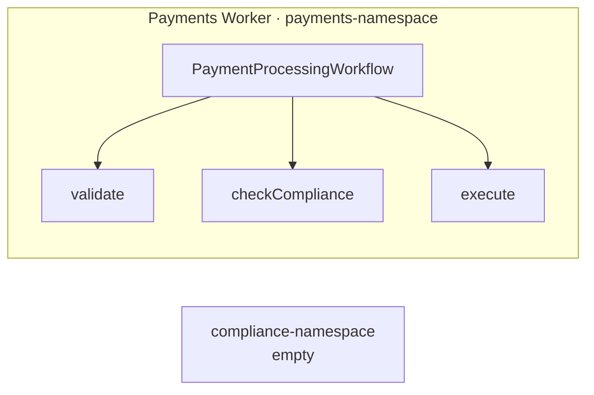
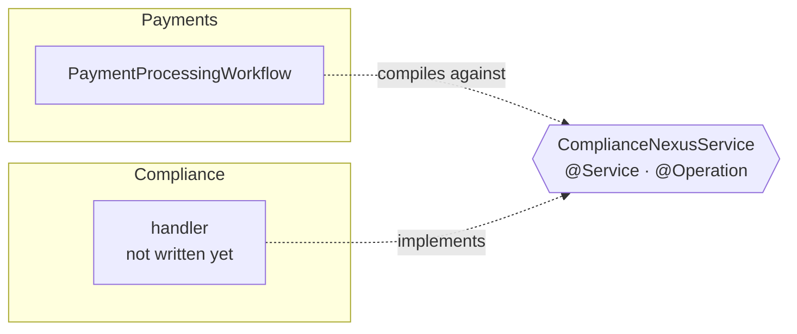
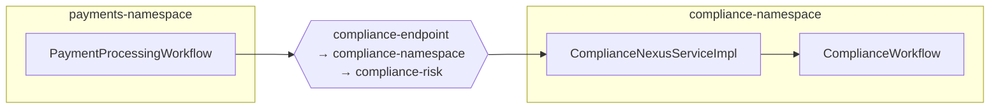
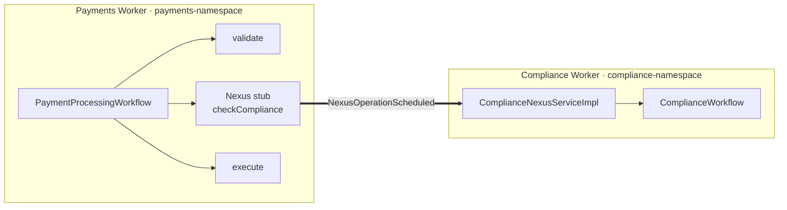
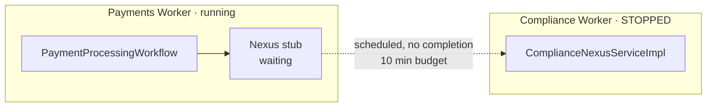

# Nexus Kotlin Workshop Slides — Implementation Plan

> **Execution model:** Nikk executes this plan by hand, one task per sitting. Claude
> delivers a concept brief before each task, answers questions during, and reviews the
> drafted slides after. Claude does not write slide content. No subagents.

**Goal:** A ~23-slide Slidev deck that interleaves with the five Instruqt challenges of
`nexus-kotlin-decouple-monolith`, filling ~37 speaking minutes of a 90-minute session.

**Architecture:** One markdown file per segment, pulled into `slides.md` via `src:`.
Question-first spine (each segment opens with that challenge's Instruqt framing
question). One Mermaid diagram in five evolving states carries the decoupling idea.
Lab handoffs use the theme's `exercise` layout with its built-in countdown timer.

**Tech Stack:** Slidev, `slidev-theme-temporal` (git dependency), Mermaid, pnpm.

**Spec:** `kotlin/docs/superpowers/specs/2026-08-11-nexus-kotlin-workshop-slides-design.md`

## Global Constraints

- Audience knows Temporal, is new to Nexus. No durable-execution primer anywhere.
- Kotlin on the Temporal **Java** SDK. All code on slides is Kotlin.
- ~37 speaking minutes total. Per-segment budgets in each task are hard, not aspirational.
- Theme is `slidev-theme-temporal`, used as-is. No custom CSS, no new Vue components.
- Nikk authors all prose. Claude supplies mechanics only.
- Terminology follows Temporal style: Workflow, Activity, Worker, Task Queue, Namespace,
  Nexus Service, Operation, Endpoint — capitalized as shown.
- Every content slide gets presenter notes. Notes are the speaker script, annotated
  build by build, matching the reference deck's convention.

## File Structure

```
kotlin/slides/
├── package.json
├── theme/                       # vendored slidev-theme-temporal, 29 layouts
├── slides.md                    # headmatter + src: imports only
├── segments/
│   ├── 00-open.md               # 3 opener + section + 6 concept slides
│   ├── 01-coupling.md           # 2 slides + exercise
│   ├── 02-contract.md           # 3 slides + exercise
│   ├── 03-handlers.md           # 3 slides + exercise
│   ├── 04-caller.md             # 2 slides + exercise
│   ├── 05-durability.md         # 2 slides + exercise
│   └── 06-close.md              # 3 slides
└── .gitignore
```

Rationale: one file per segment means you can rewrite Segment 3 without scrolling past
everything else, and a segment that overruns can be cut without touching its neighbors.

---

### Task 0: Scaffold

**Files:**
- Create: `kotlin/slides/package.json`, `kotlin/slides/slides.md`, `kotlin/slides/.gitignore`

- [ ] **Step 1: Create the project and install**

```bash
mkdir -p kotlin/slides/segments
cd kotlin/slides
pnpm init
pnpm add -D @slidev/cli playwright-chromium
git clone --depth 1 https://github.com/temporalio/slidev-theme-temporal.git theme
rm -rf theme/.git theme/.gitignore
```

`playwright-chromium` is only needed for PDF export in Task 8; installing it now avoids
a surprise later.

**The theme is vendored, not installed as a package.** `pnpm add
github:temporalio/slidev-theme-temporal` installs fine but the build then fails with
`ENOENT`: pnpm names the store directory for a git dependency with a `#<commit>`
suffix, and Vite's CSS `url()` resolver treats `#` as a fragment separator, so the
theme's five background-image references resolve to a truncated path. Vendoring is
Option 2 in the theme's own README and what the Replay workshop deck does.

- [ ] **Step 2: Add scripts to `package.json`**

```json
{
  "scripts": {
    "dev": "slidev --open",
    "build": "slidev build",
    "export": "slidev export"
  }
}
```

- [ ] **Step 3: Write `.gitignore`**

```
node_modules/
dist/
.slidev/
*.pdf
```

- [ ] **Step 4: Write `slides.md`**

Headmatter plus imports, nothing else. Content lives in `segments/`.

```md
---
theme: ./theme
title: Decouple a Monolith with Temporal Nexus
info: |
  ## Kotlin workshop
  90 minutes. Five hands-on challenges. Split a payments monolith into two
  independently deployable services connected by Nexus.
author: Nikolay Advolodkin
keywords: temporal,nexus,kotlin,java,microservices
colorSchema: dark
fonts:
  sans: 'Inter'
  mono: 'Noto Sans Mono'
  weights: '200,300,400,500,600'
  italic: false
mdc: true
layout: cover
---

# Decouple a Monolith with Temporal Nexus

## Kotlin

---
src: ./segments/00-open.md
---

---
src: ./segments/01-coupling.md
---

---
src: ./segments/02-contract.md
---

---
src: ./segments/03-handlers.md
---

---
src: ./segments/04-caller.md
---

---
src: ./segments/05-durability.md
---

---
src: ./segments/06-close.md
---
```

- [ ] **Step 5: Create empty segment files**

```bash
mkdir -p segments
for f in 00-open 01-coupling 02-contract 03-handlers 04-caller 05-durability 06-close; do
  printf -- "---\nlayout: default\n---\n\n# TODO\n" > "segments/$f.md"
done
```

- [ ] **Step 6: Verify it runs**

Run: `pnpm dev`
Expected: browser opens `http://localhost:3030`, cover slide renders with the Temporal
gradient backdrop, and arrow keys walk through eight placeholder slides. If the theme
fails to resolve, the `pnpm add github:` step needs GitHub access to the `temporalio` org.

Leave `pnpm dev` running for every task that follows. It hot-reloads on save.

- [ ] **Step 7: Commit**

```bash
cd /Users/nikk/source/edu-nexus-code
git add kotlin/slides
git commit -m "chore(slides): scaffold Slidev deck with Temporal theme"
```

---

## Syntax reference

Everything you need for Tasks 1-7. Paste and adapt; no need to read Slidev docs.

**Slide separator:** `---` on its own line, blank line before and after.

**Per-slide layout:**

```md
---
layout: two-cols
---
```

The theme ships 29 layouts. The ones worth knowing for this deck:

| Layout | Use it for |
|---|---|
| `cover` | Title slide |
| `default` | Standard body slide |
| `section` / `subsection` | Segment dividers |
| `exercise` | Lab handoff, with the countdown timer |
| `two-cols` / `two-cols-header` | Side-by-side |
| `comparison` | Segment 3's right-choice vs. wrong-choice slide |
| `code-explain` | Code with annotation alongside |
| `architecture` | The diagram states |
| `big-stat` | A single number or one-line punchline |
| `checklist` | Segment 6's recap |
| `qa` | Q&A holding slide |
| `end` | Closing slide |

Full list in `slides/theme/layouts/`. Read a layout's `.vue` file to see which props it
takes — several accept frontmatter beyond `layout:`.

**Progressive reveal** — each bullet appears on a click:

```md
<v-clicks>

- First point
- Second point
- Third point

</v-clicks>
```

Blank lines around the tag are required.

**Code with per-click line highlighting** — `1` then `3-5` then everything:

````md
```kotlin {1|3-5|all}
@Service
interface ComplianceNexusService {
    @Operation
    fun checkCompliance(request: ComplianceRequest): ComplianceResult
}
```
````

**Two columns:**

```md
---
layout: two-cols
---

# Left heading

Left content.

::right::

# Right heading

Right content.
```

**Lab handoff slide** — the timer runs itself:

```md
---
layout: exercise
minutes: 10
heading: Challenge 1
---

**Run the monolith.** Find the coupling before you fix it.
```

**Mermaid diagram:**

````md

````

`scale` is how you fit a diagram to the slide. Start at `0.55` and adjust.

**Presenter notes** — HTML comment, last thing in the slide:

```md
<!--
- Opening line you actually say.
- **Build 1 -** what the first click reveals, and the point it makes.
- **Build 2 -** ...
-->
```

**Speaker view:** press `P`. **Overview of all slides:** press `O`.

---

## The five diagram states

Paste these in as the segments call for them. Edit freely — they are a starting point,
not a spec.

**State 1 — monolith (Segment 1):**

````md

````

**State 2 — contract inserted (Segment 2):**

````md

````

**State 3 — handler and Endpoint (Segment 3):**

````md

````

**State 4 — call crosses the boundary (Segment 4):**

````md

````

**State 5 — handler dark, caller parked (Segment 5):**

````md

````

---

### Task 1: Segment 0 — Open

**Budget:** 10 slides, 11 minutes. **File:** `segments/00-open.md`

Three opener slides, a `section` divider, then the six-slide concept block: one
definition-plus-code slide per Nexus concept, all taught before anyone opens the editor.
Segments 2, 3, and 4 shrink correspondingly — they become recall and application rather
than first exposure.

**Concept brief before you start** — Claude covers:
- Blast radius as a deployment property, not a code property: why "it works fine" is
  exactly what makes shared-Worker coupling survive code review. Includes Worker
  task-slot starvation, which is coupling with no bug in it.
- Namespace as Temporal's isolation unit, and what it isolates (Task Queue names,
  Workflow IDs, retention, search attributes, access) versus what it does not
  (processes, and infrastructure).

- [ ] **Step 1: Draft slide 1 — the 3 AM story**

Cold open on the failure, not on Nexus. The track description already has the line:
a compliance bug at 3 AM takes payments down with it. One `default` slide.

- [ ] **Step 2: Draft slide 2 — what you'll have built**

Before/after in one breath. Resist listing the four Nexus pieces here; Segment 2 owns
that and repeating it costs you a minute you don't have.

- [ ] **Step 3: Draft slide 3 — how the session runs**

Five challenges, slides between each, Solution tab always one click away. Set the
expectation now that finishing every challenge in the room is not the goal.

- [ ] **Step 4: Write the six concept slides**

Scaffolded already in `segments/00-open.md`: a `section` divider, then six
`code-explain` slides — Service, Operation, Endpoint, Caller, Handler, Sync vs async.
Each has real Kotlin from the solution tree in its `::code::` slot, click-through line
highlighting, source file:line in its presenter notes, and a "must establish" note
telling you what the definition has to accomplish.

Your job is the prose pane on each. Replace "Your definition here." Roughly 40 words —
the pane is narrow, and the code is doing half the work.

~60 seconds per slide. If one runs long it is almost always Sync vs async; the
`comparison` layout gives that one more room if it needs it.

- [ ] **Step 5: Write presenter notes for the three opener slides**

The concept slides already have notes. Extend rather than replace them.

- [ ] **Step 6: Check timing**

Present it out loud against a timer. Target 11 minutes: ~4 for the three opener slides,
~7 for the concept block. Over 13 means cut, not talk faster.

- [ ] **Step 7: Claude reviews**

Paste the segment. Review checks: does it open on failure rather than technology, does
it avoid pre-empting Segment 2, is the terminology right.

- [ ] **Step 8: Commit**

```bash
git add kotlin/slides/segments/00-open.md
git commit -m "docs(slides): segment 0, open"
```

---

### Task 2: Segment 1 — The coupling

**Budget:** 2 slides + exercise, 3 minutes. **File:** `segments/01-coupling.md`
**Framing question (from C1 notes):** "What breaks when two teams share one Worker?"

**Concept brief** — Claude covers:
- What one Worker process registering both teams' code actually means at runtime:
  shared Task Queue, shared deployment, shared JVM, shared failure.
- Why the Instruqt banner line `ComplianceActivity (monolith, will decouple)` is the
  coupling written down.
- What attendees will see in `compliance-namespace` and why empty is the point.
- **Vocabulary owed here:** Namespace as isolation unit, in its sharp form — the monolith
  already has two Namespaces and gets nothing from them, because `ComplianceActivityImpl`
  is registered on a Worker polling `payments-namespace`
  (`PaymentsWorkerApp.kt:30-64`). Isolation comes from which process polls which queue in
  which Namespace, not from how many Namespaces exist.
- Worker task-slot starvation: bounded concurrent Activity slots mean slow compliance
  checks throttle payment throughput with no bug on either side. Spend this here rather
  than in Segment 0.

- [ ] **Step 1: Draft slide 1 — the framing question + diagram state 1**

Question as the heading. Diagram state 1 below it. Let the empty
`compliance-namespace` box do the arguing.

- [ ] **Step 2: Draft slide 2 — why this survives review**

`<v-clicks>` on three consequences of one Worker. The tension to land: the system is
correct, the tests pass, and it is still wrong.

- [ ] **Step 3: Add the lab handoff slide**

```md
---
layout: exercise
minutes: 10
heading: Challenge 1
---

**Run the monolith.** Three payments, two teams, one Worker.
Find the coupling before you fix it.
```

- [ ] **Step 4: Presenter notes**

- [ ] **Step 5: Claude reviews, then commit**

```bash
git add kotlin/slides/segments/01-coupling.md
git commit -m "docs(slides): segment 1, the coupling"
```

---

### Task 3: Segment 2 — The contract

**Budget:** 3 slides + exercise, 4 minutes. **File:** `segments/02-contract.md`

Shrunk: the contract-in-Kotlin slide moved into Segment 0's concept block. What remains
is framing, "why not HTTP", and the diagram. Recall, not first exposure.
**Framing question (from C2 notes):** "How do two teams agree on a call neither one owns?"

**Concept brief** — Claude covers:
- What you hand-write when two Temporal services talk over HTTP: retry policy, timeout
  budget, idempotency keys, callback endpoint, and the state to correlate the callback.
  This is the "why not HTTP" slide's raw material.
- Service, Operation, Endpoint — what each is, who owns it, and where it lives (two in
  code, one outside it). Registry is cut: the Endpoint lives in a registry the server
  manages, and no challenge touches it.
- Why the contract lives in `shared/` and what it means that neither team owns it alone.
- The validation rule that bites: every method needs `@Operation` at Worker start, even
  ones nobody calls yet.
- **Vocabulary owed here:** Caller and Handler, named as a pair — the lab uses both
  words from C3 onward without ever introducing them. And Namespace plus Task Queue in
  their new role as the two halves of an Endpoint's address, which is the reframing the
  audience needs even though they already know both terms.

- [ ] **Step 1: Draft slide 1 — the framing question**

- [ ] **Step 2: Draft slide 2 — why not HTTP**

The slide that protects your Q&A. Enumerate what you'd write by hand. Do not answer
with "durability" alone; the room already believes in durability.

- [ ] **Step 3: Draft slide 3 — the pieces, and who calls whom**

Consider `two-cols` with the three names on the left and diagram state 2 on the right.
This slide also owes the Caller/Handler pair and the Namespace-plus-Task-Queue-as-address
reframing — the diagram is what makes both land without a definition list.

- [ ] **Step 4: Draft slide 4 — the contract in Kotlin**

Real code from `shared/nexus/ComplianceNexusService.kt`, with click-through
highlighting: `@Service` first, then the two `@Operation` methods.

````md
```kotlin {1-2|3-4|6-7|all}
@Service
interface ComplianceNexusService {
    @Operation
    fun checkCompliance(request: ComplianceRequest): ComplianceResult

    @Operation
    fun submitReview(request: ReviewRequest): ComplianceResult
}
```
````

Verify the signatures against the solution file before you present:
`kotlin/decouple-monolith/solution/src/main/kotlin/shared/nexus/ComplianceNexusService.kt`

- [ ] **Step 5: Lab handoff — `minutes: 8`, `heading: Challenge 2`**

- [ ] **Step 6: Presenter notes**

- [ ] **Step 7: Claude reviews, then commit**

```bash
git add kotlin/slides/segments/02-contract.md
git commit -m "docs(slides): segment 2, the contract"
```

---

### Task 4: Segment 3 — Handlers

**Budget:** 3 slides + exercise, 5 minutes. **File:** `segments/03-handlers.md`
**Framing question (from C3 notes):** "A compliance check can wait on a human. How do
you put that behind an RPC?"

Shrunk: the two handler-shape slides and the Endpoint slide moved into Segment 0's
concept block. What stays here is the part that has to be adjacent to the lab — the
duplicate-Workflow failure, the three Worker registrations, and the diagram.

Sync-versus-async is still the Nexus mistake that reaches production. Segment 0 defines
the two shapes; this segment is where you show what choosing wrong does.

**Concept brief** — Claude covers, in more depth than any other segment:
- `WorkflowRunOperation`: what it returns, how the handle binds to a Workflow ID, and
  the precise mechanism by which a retried Operation re-attaches to the running
  Workflow instead of starting a second one.
- `OperationHandler.sync`: the 10-second total budget, what it is actually for
  (steering work already in flight), and why an Update fits inside it.
- The failure mode in full: back a long check with `sync` and every retry starts a
  duplicate Workflow. What that looks like in the UI and why it is not obvious.
- Endpoint as the only piece of Nexus outside your code; Namespace + Task Queue
  targeting; and the silent failure when `--target-task-queue` names a queue nobody
  polls.
- Worker registration: three registrations, and why the Nexus one takes a constructed
  instance rather than a class.
- The Kotlin wrinkle: `OperationHandler.sync` declares its input `@Nullable`, so Kotlin
  sees `ReviewRequest?` and you need `!!`. The async handler does not.
- **Vocabulary owed here:** Workflow ID, as the thing that makes an Operation retry
  idempotent rather than duplicative. And Update — one sentence, because `submitReview`
  is one and neither the lab nor the deck has said so yet.

- [ ] **Step 1: Draft slide 1 — the framing question**

Land the concrete version: some checks clear in milliseconds, a $12,000 international
transfer waits for an officer who is at lunch.

- [ ] **Step 2: Draft slide 2 — the wrong choice**

The duplicate-Workflow failure, and the most important slide in the segment. Segment 0
already showed both handler shapes; this is what picking the wrong one costs. The
`comparison` layout is built for it — correct on one side, duplicated executions on the
other. Give it the room.

Also carries diagram state 3, unless it crowds the slide — in which case state 3 moves
to slide 3.

- [ ] **Step 3: Draft slide 3 — three registrations**

Workflow, Activity, Nexus handler. Flag that a Worker starts fine having registered
nothing, so `Nexus Poller` in the startup lines is the real checkpoint. Add the silent
Endpoint failure here too: a `--target-task-queue` nobody polls swallows calls without
an error.

- [ ] **Step 4: Lab handoff — `minutes: 15`, `heading: Challenge 3`**

Say the quiet part on this slide: the Solution tab is one click away and using it is
fine. C3's own notes already say this; the slide should agree.

- [ ] **Step 5: Presenter notes**

Thickest notes in the deck. If you present this segment once a quarter, these notes are
what make the second delivery good. Include the Kotlin `!!` wrinkle and the Update
sentence here even though neither is on a slide — they are the questions you will get.

- [ ] **Step 6: Time it strictly**

5 minutes across 3 slides. Over budget means cutting slide 3 and folding registration
into the lab handoff — never compressing slide 2.

- [ ] **Step 7: Claude reviews, then commit**

```bash
git add kotlin/slides/segments/03-handlers.md
git commit -m "docs(slides): segment 3, sync and async handlers"
```

---

### Task 5: Segment 4 — The caller

**Budget:** 2 slides + exercise, 3 minutes. **File:** `segments/04-caller.md`
**Framing question (from C4 notes):** "How much code changes when you cross a team boundary?"

Shrunk: Segment 0's Caller slide already showed `newNexusServiceStub` and made the point
that no Endpoint name appears in the Workflow. Do not show that code again.

**Concept brief** — Claude covers:
- `Workflow.newNexusServiceStub` and why swapping it for the Activity stub is a one-line
  change at the call site.
- The separation attendees usually miss: the Workflow names the *contract*, the Worker
  names the *Endpoint*. Why that is a deliberate design and what it buys you.
- `scheduleToCloseTimeout` as the outage budget, set once, proven in Segment 5.
- Why TXN-B's behavior changes after decoupling — same business rules, but the durable
  boundary makes a wait that was always there finally visible.
- **Vocabulary owed here:** Event History as the place the boundary becomes visible
  (`NexusOperationScheduled` / `NexusOperationCompleted`), and
  `scheduleToCloseTimeout` framed as an outage budget rather than a latency guard.

- [ ] **Step 1: Draft slide 1 — who names what**

Workflow names the contract, Worker names the Endpoint, with diagram state 4. The
`registerWorkflowImplementationTypes` overload taking `WorkflowImplementationOptions` is
the new code here — the stub itself is not.

- [ ] **Step 2: Draft slide 2 — TXN-B changed**

The result table from C4. The most interesting observation in the workshop and the
easiest to skip past: the transaction that completed instantly in the monolith now parks
for human review, and nothing about the business rules changed.

- [ ] **Step 3: Lab handoff — `minutes: 10`, `heading: Challenge 4`**

- [ ] **Step 4: Presenter notes**

- [ ] **Step 5: Claude reviews, then commit**

```bash
git add kotlin/slides/segments/04-caller.md
git commit -m "docs(slides): segment 4, the caller"
```

---

### Task 6: Segment 5 — Durability

**Budget:** 2 slides + exercise, 4 minutes. **File:** `segments/05-durability.md`
**Framing question (from C5 notes):** "The Compliance team is deploying. What happens to
payments in flight?"

**Concept brief** — Claude covers:
- What the caller's Event History shows during the outage: `NexusOperationScheduled`
  with no completion, status `Running`, not `Failed`.
- Operation retry with backoff, and why resumption is not instant when the handler
  returns (the up-to-a-minute delay attendees will notice).
- Where `scheduleToCloseTimeout` actually bounds the outage.
- What the equivalent HTTP call would have done, and the code you would be writing.

- [ ] **Step 1: Draft slide 1 — the framing question + diagram state 5**

- [ ] **Step 2: Draft slide 2 — pending, not failed**

The one line worth putting on a slide alone: *the payments never failed, they waited.*

- [ ] **Step 3: Lab handoff — `minutes: 7`, `heading: Challenge 5`**

- [ ] **Step 4: Presenter notes**

Include the pacing warning from C5: wait for TXN-A to complete before running
`reviewStarter`, or the 10-second sync budget expires and it fails.

- [ ] **Step 5: Claude reviews, then commit**

```bash
git add kotlin/slides/segments/05-durability.md
git commit -m "docs(slides): segment 5, durability"
```

---

### Task 7: Segment 6 — Close

**Budget:** 3 slides, 5 minutes. **File:** `segments/06-close.md`

**Concept brief** — Claude covers:
- When *not* to reach for Nexus: same team, same deployment cadence, no Namespace
  boundary worth defending. What Nexus costs you in operational surface.
- Where Nexus sits relative to Child Workflows and Activities, since that is the
  question this segment invites.

- [ ] **Step 1: Draft slide 1 — the recap table**

Reuse the table already written at the end of C5's assignment. It is good and it is
yours.

- [ ] **Step 2: Draft slide 2 — when not to use Nexus**

The slide that makes the whole deck credible. A talk that never says "don't" reads
as marketing.

- [ ] **Step 3: Draft slide 3 — where to go next**

Use the theme's `end` layout. Docs, the Java SDK Nexus samples, this repo.

- [ ] **Step 4: Presenter notes**

- [ ] **Step 5: Claude reviews, then commit**

```bash
git add kotlin/slides/segments/06-close.md
git commit -m "docs(slides): segment 6, close"
```

---

### Task 8: Full run-through and export

**Files:** none created; fixes land in existing segment files.

- [ ] **Step 1: Present the whole deck against a timer**

Speaker view (`P`), out loud, no lab pauses. Record the per-segment times.
Expected: ~37 minutes. Over 42 means cutting a slide, and the first candidates are
Segment 0 slide 3 and Segment 3 slide 6.

- [ ] **Step 2: Check every diagram at presentation resolution**

Overview mode (`O`) hides scaling problems. Walk the deck full-screen on the display
you'll actually present from and adjust each `{scale: ...}`.

- [ ] **Step 3: Verify every code slide against the solution tree**

Each Kotlin snippet must match `kotlin/decouple-monolith/solution/`. A slide that
disagrees with the Solution tab will be found by an attendee, live.

- [ ] **Step 4: Export a PDF backup**

Run: `pnpm export`
Expected: `slides-export.pdf` in `kotlin/slides/`. Conference wifi fails; the PDF is
the fallback.

- [ ] **Step 5: Commit**

```bash
git add kotlin/slides
git commit -m "docs(slides): timing pass and PDF export"
```

---

## Self-review notes

Checked against the spec:
- Segment map, slide counts, and minute budgets match the spec table exactly.
- All 8 concepts in the spec's inventory are assigned: 1 → Task 1, 2-3 → Task 3,
  4 → Task 4, 5 → Task 4, 6 → Task 5, 7 → Task 6, 8 → Task 7.
- Spec's four Slidev support items are delivered: scaffold (Task 0), snippets (Syntax
  reference), five diagram states (The five diagram states), export (Task 8).
- The spec's `exercise`-layout decision is used in all five lab handoffs.
- Reference-deck conventions adopted: `src:` per segment, `<v-clicks>`, scaled Mermaid,
  thick presenter notes.
